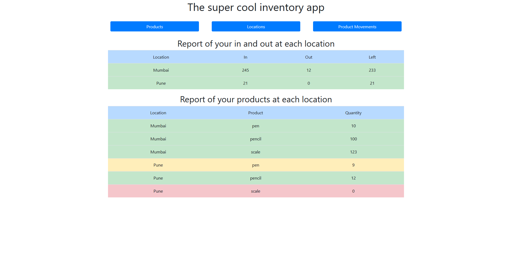
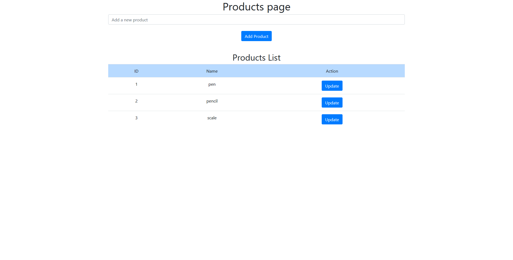
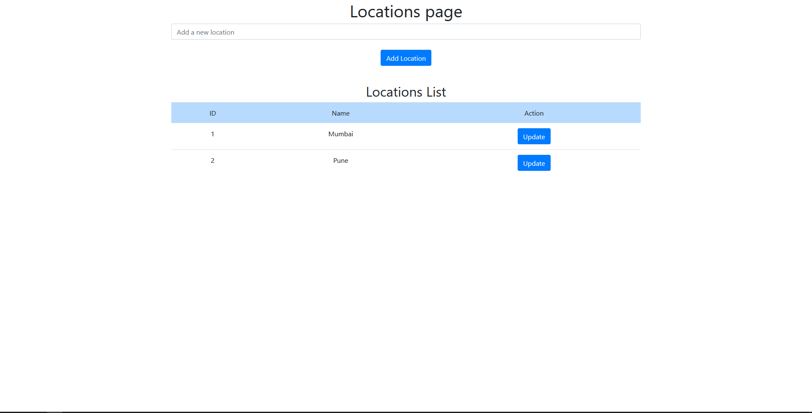
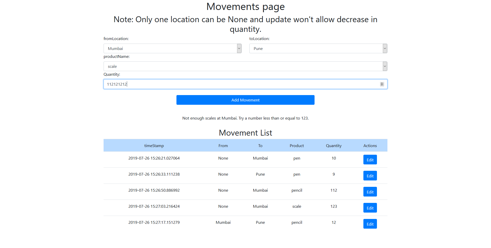
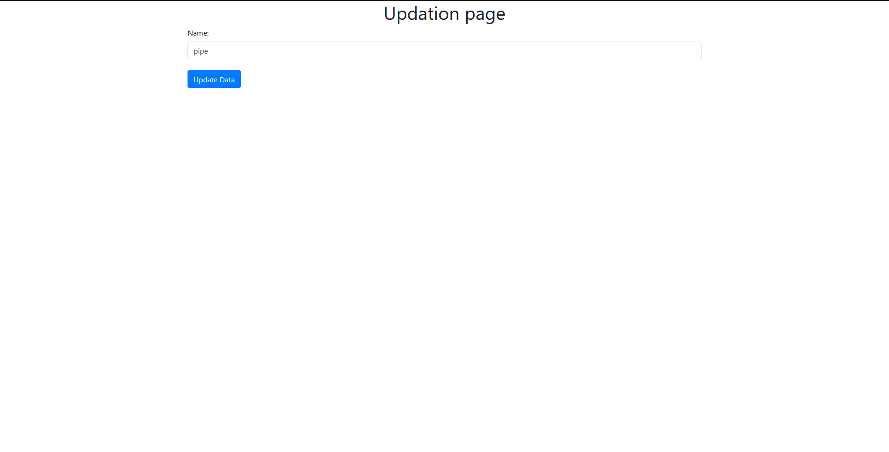

# Test project for frappe.io
This is a small inventory management app made in py and flask using bootstrap for front end css. 
Details of the project [here](https://frappe.io/flask-test)

## Screenshots

## Index page with reports

## Products page

## Locations page

## Movements page

## Update page

## For products and locations

## For Movements

